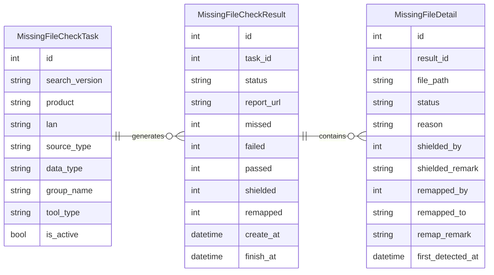

```mermaid
erDiagram
    direction LR
    MissingFileCheckTask ||--o{ MissingFileCheckResult : generates
    MissingFileCheckTask {
        int id
        string search_version
        string product
        string lan
        string source_type
        string data_type
        string group_name
        string tool_type
        bool is_active
    }
    MissingFileCheckResult ||--o{ MissingFileDetail : contains
    MissingFileCheckResult {
        int id
        int task_id
        string status
        string report_url
        int missed
        int failed
        int passed
        int shielded
        int remapped
        datetime create_at
        datetime finish_at
    }
    MissingFileDetail {
        int id
        int result_id
        string file_path
        string status
        string reason
        int shielded_by
        string shielded_remark
        int remapped_by
        string remapped_to
        string remap_remark
        datetime first_detected_at
    } 

```